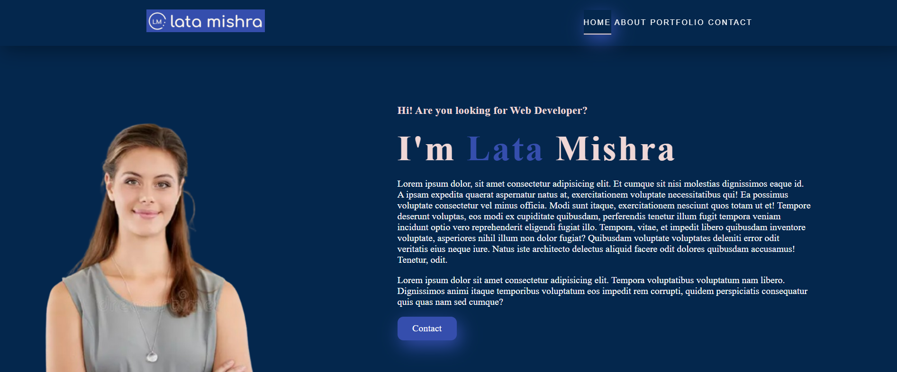
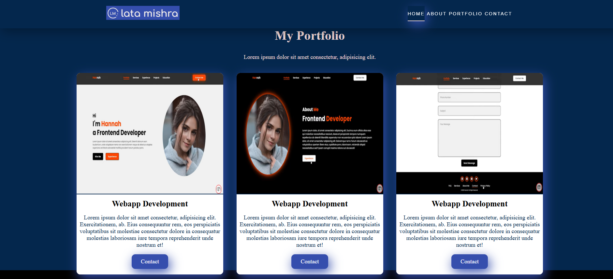

# 🌐 Single Page Portfolio Website

This is a **responsive single-page portfolio website** built using **HTML and CSS**.  
It showcases a simple design with smooth scrolling and modern layout — perfect for personal branding and portfolio presentation.

---

## 📌 Features

- Clean and minimalistic design
- Responsive layout (mobile-friendly)
- HTML5 and CSS3 only (no frameworks)
- Sections: Home, About, Projects, Contact
- Smooth scrolling navigation

---

## 🚀 Live Demo

🔗 [View Live Website](https://single-page-website-lata.netlify.app/)

---

## 📁 Project Structure
📂 Single Page Website/
├── index.html # Main HTML file
├── style.css # Styling for the site
├── README.md # This file
└── img/ # Images used in the website

---

## 🛠️ Technologies Used

- HTML5
- CSS3

---

## 📸 Preview

![Screenshot]

---

## 🤝 Connect with Me

- GitHub: [latamishra5](https://github.com/latamishra5)
- LinkedIn: [https://www.linkedin.com/in/latamishra5]
